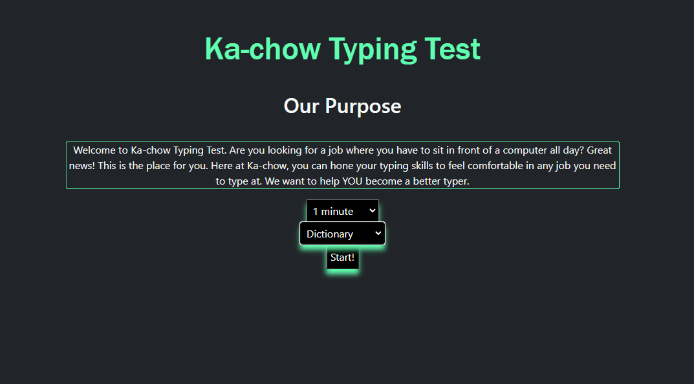
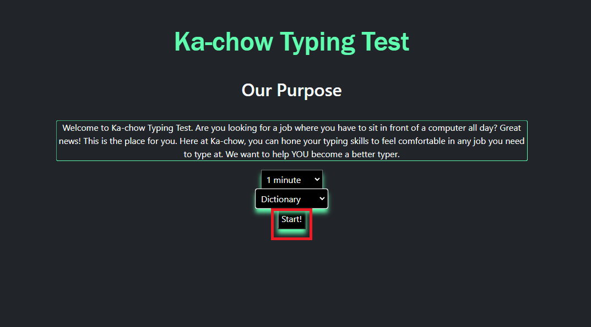
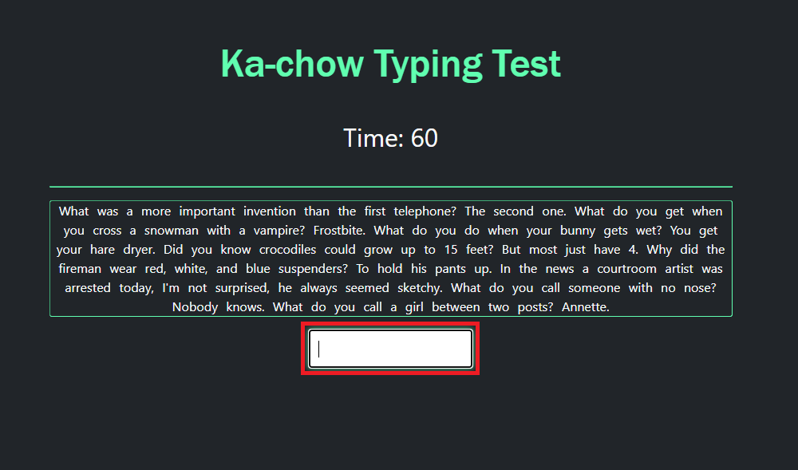
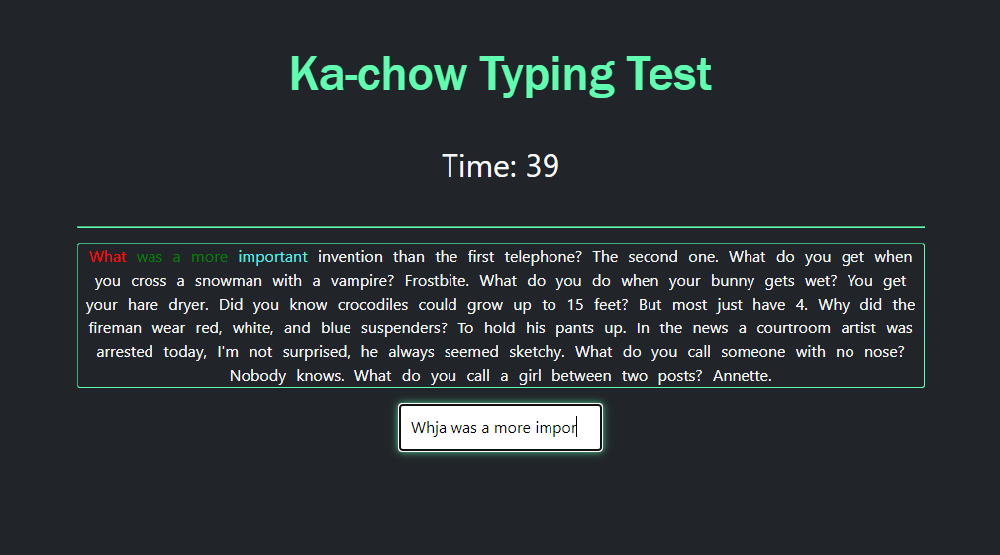
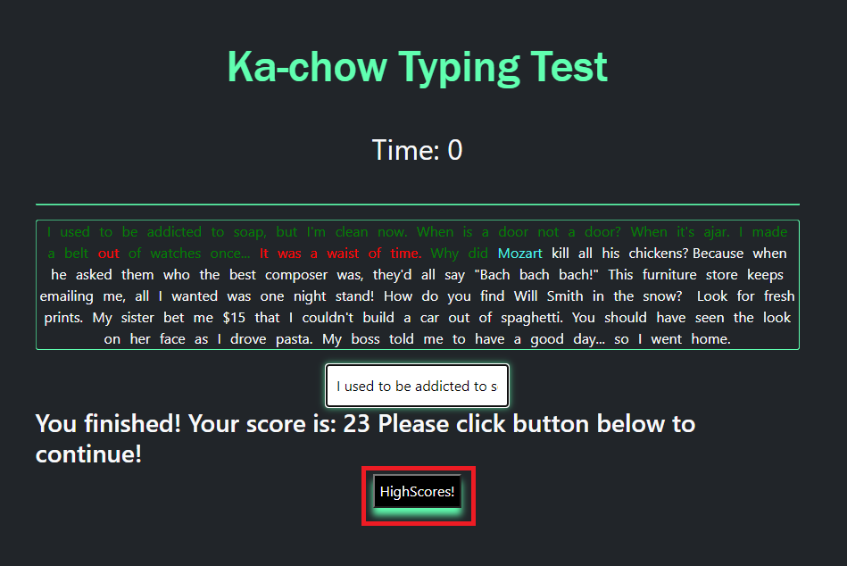
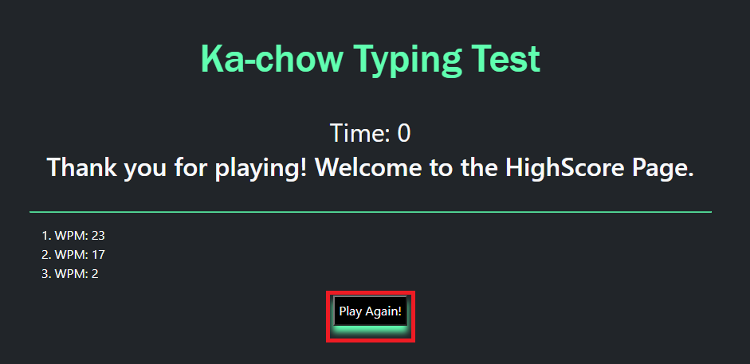

# daniel-typing-test

# Ka-Chow Typing Test

A test to track typing speed, accuracy, and versatility.

# Improve your typing skills!
## Click the link below to get typing!
https://amhum.github.io/typingTest/

## How to use the typing test

Select time and content from the drop down boxes, then press the Start! button.

## Click on the text input box below the text content

## Once typing has begun the timer will start

As you type the content above will change color based on your current word, incorrect words (red), and correct words (green).

## Times Up!
Once the timer is up you will no longer be able to input text, and your score will be displayed below. Click the Highscores! button to save and see scores

## Scores Page
Here are all the saved scores! Click the Play Again! button to do a new test.

## Built By 
Daniel Jardine, Aaron Humelsine, and David Hart
